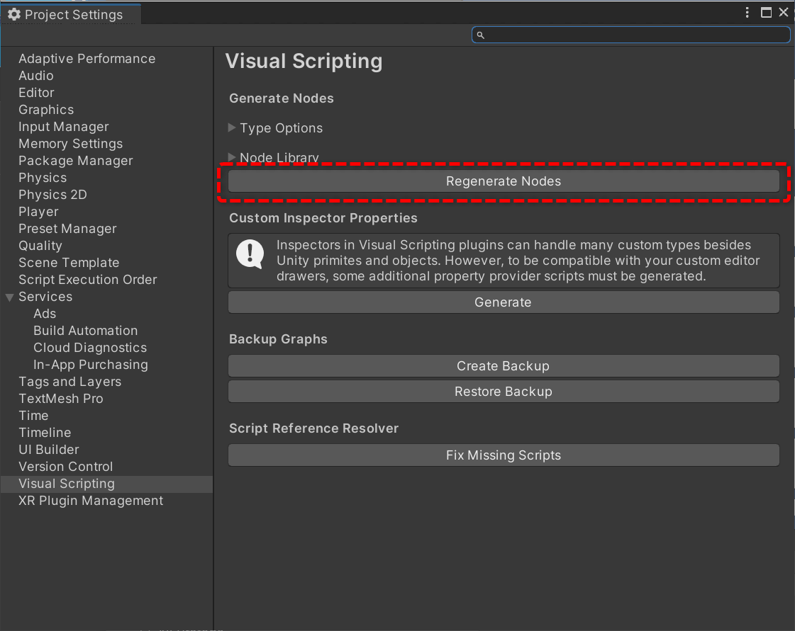
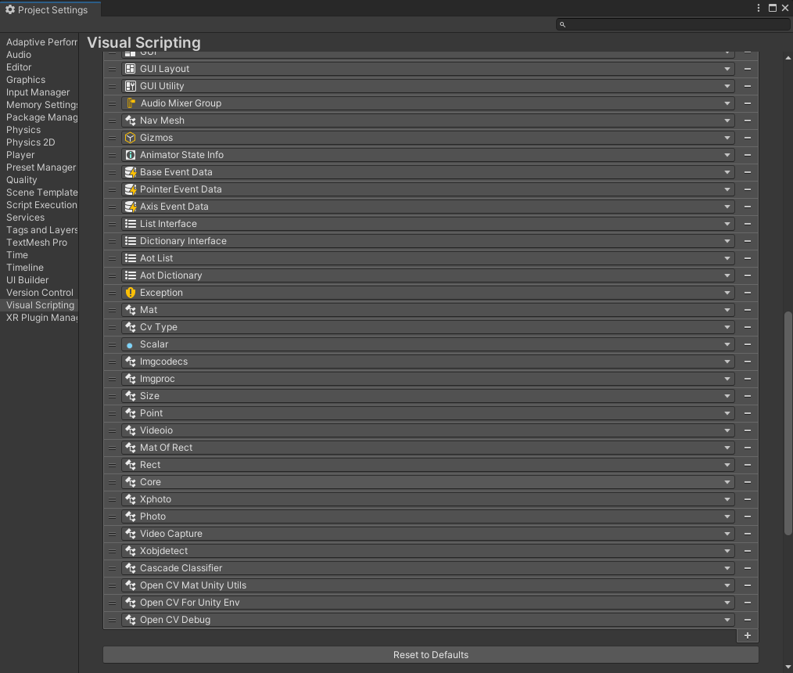
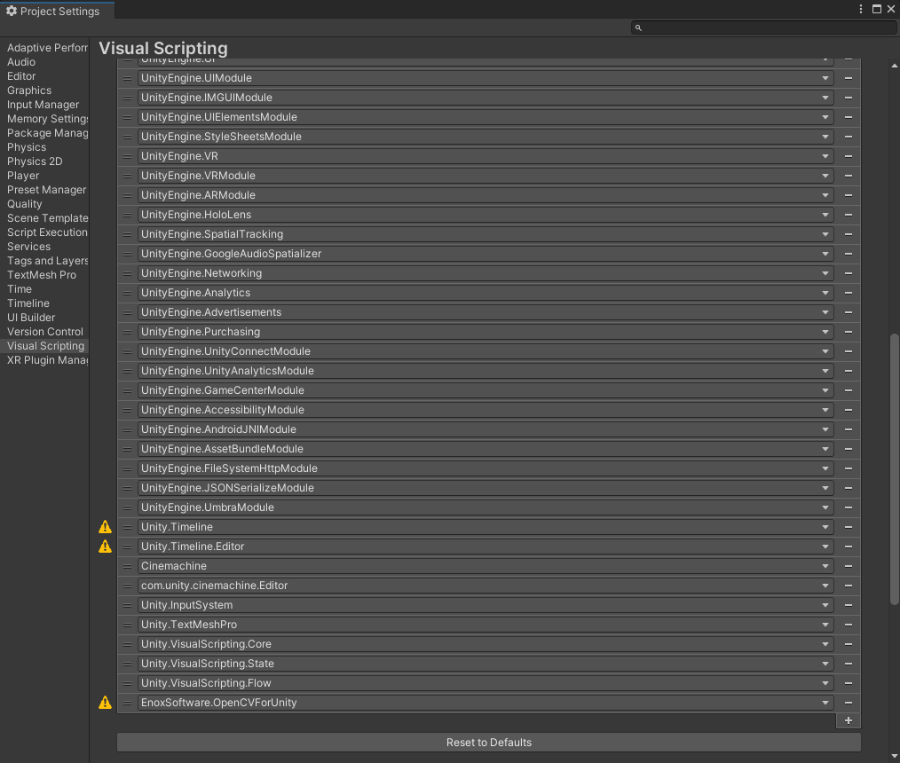
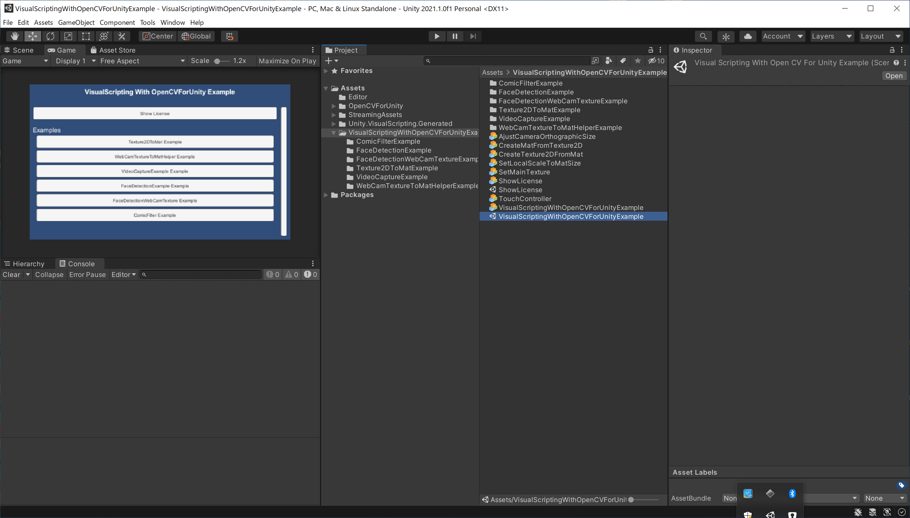
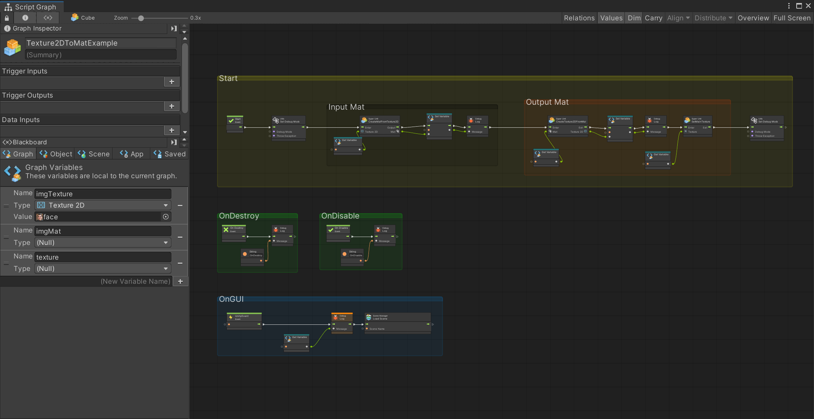
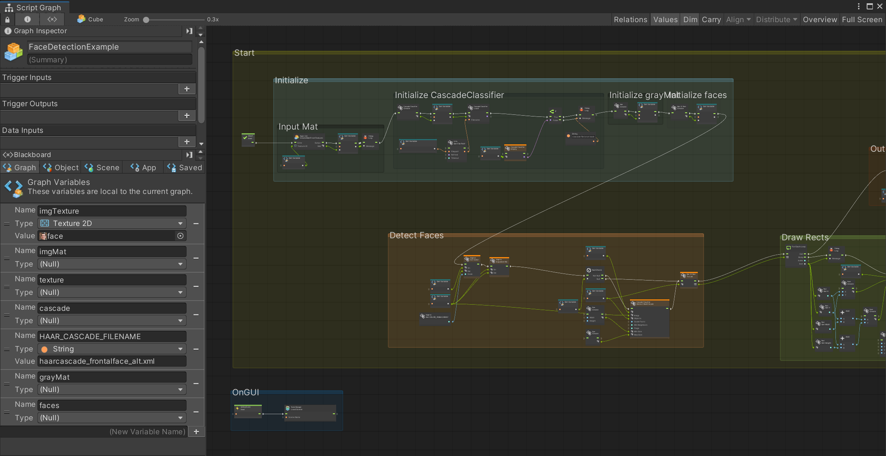

# VisualScripting With OpenCVForUnity Example

## Overview

- Integrates **[Visual Scripting](https://docs.unity3d.com/Manual/com.unity.visualscripting.html)** with **[OpenCV for Unity](https://assetstore.unity.com/packages/tools/integration/opencv-for-unity-21088?aid=1011l4ehR)** for node-based image processing (e.g. Texture2D to Mat, face detection).

## Environment

- **Unity 2021.3.45f2+**
- [OpenCV for Unity](https://assetstore.unity.com/packages/tools/integration/opencv-for-unity-21088?aid=1011l4ehR) **3.0.2+**
- **Visual Scripting 1.9.10**

## Setup

1. Download the latest release unitypackage from [VisualScriptingWithOpenCVForUnityExample.unitypackage](https://github.com/EnoxSoftware/VisualScriptingWithOpenCVForUnityExample/releases).
2. Create a new project. *(ex. VisualScriptingWithOpenCVForUnityExample)*
3. Import and Setup [OpenCV for Unity](https://assetstore.unity.com/packages/tools/integration/opencv-for-unity-21088?aid=1011l4ehR).
   - Select Menu Item `Tools > OpenCV for Unity > Open Setup Tools`.
   - Click the `Move StreamingAssets Folder` button.
4. Import [VisualScriptingWithOpenCVForUnityExample.unitypackage](https://github.com/EnoxSoftware/VisualScriptingWithOpenCVForUnityExample/releases).
5. Replace `Assets/VisualScriptingWithOpenCVForUnityExample/VisualScriptingSettings.asset` with `ProjectSettings/VisualScriptingSettings.asset`.
6. Open `Project Settings` > `Visual Scripting` > `Regenerate Units`
    
    
    
    

## ScreenShot

