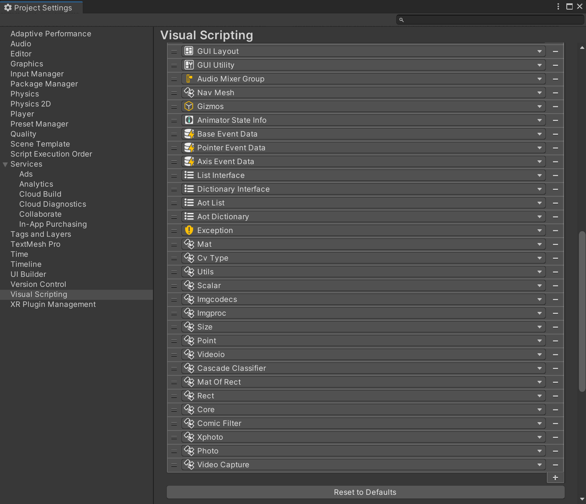

# VisualScripting With OpenCVForUnity Example

## Overview

## Environment
* Unity 2021.1.0f1
* [OpenCV for Unity](https://assetstore.unity.com/packages/tools/integration/opencv-for-unity-21088?aid=1011l4ehR) 2.4.4
* Visual Scripting 1.5.1

## Setup
1. Download the latest release unitypackage. [VisualScriptingWithOpenCVForUnityExample.unitypackage](https://github.com/EnoxSoftware/VisualScriptingWithOpenCVForUnityExample/releases)
1. Create a new project.
1. Import the OpenCVForUnity.
    * Setup the OpenCVForUnity. (Tools > OpenCV for Unity > Set Plugin Import Settings)
    * Move the "OpenCVForUnity/StreamingAssets/" folder to the "Assets/" folder.    
1. Import the VisualScriptingWithOpenCVForUnityExample.unitypackage.
1. Project Settings > Visual Scripting > Regenerate Units

## ScreenShot
 

